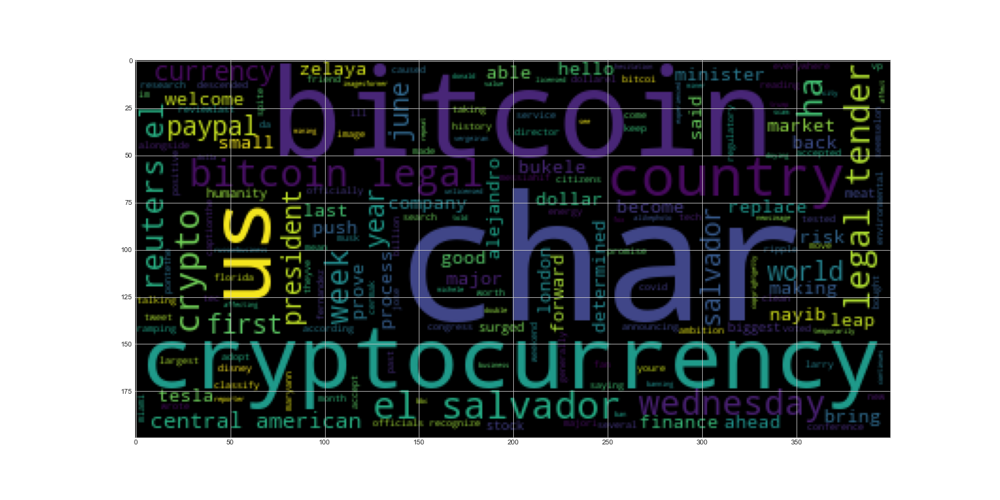
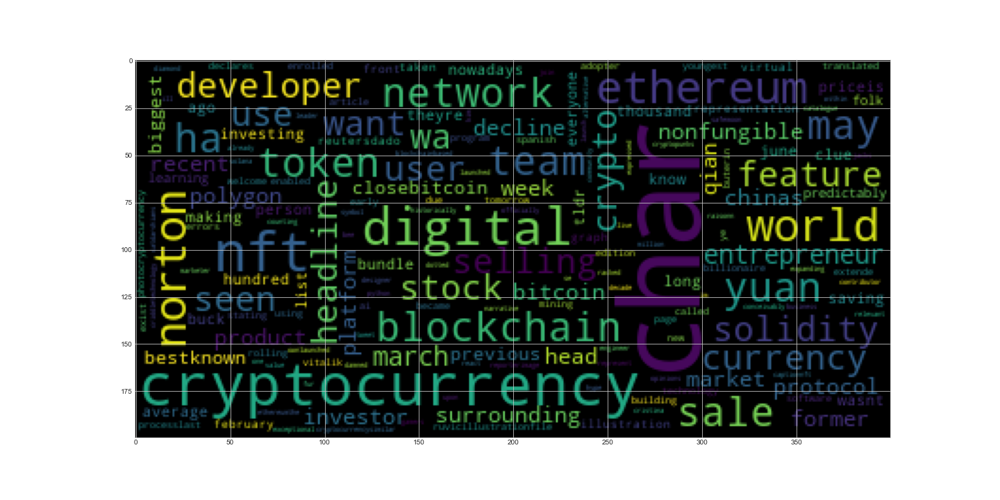

# Natural Language Processing - Week 12

## Sentiment Analysis ##

---

In this assignment, I have tokenized news articles collected via an API to perform sentiment analysis, collect data on the most common words used when discussing cryptocurrencies and built word clouds to display that data.